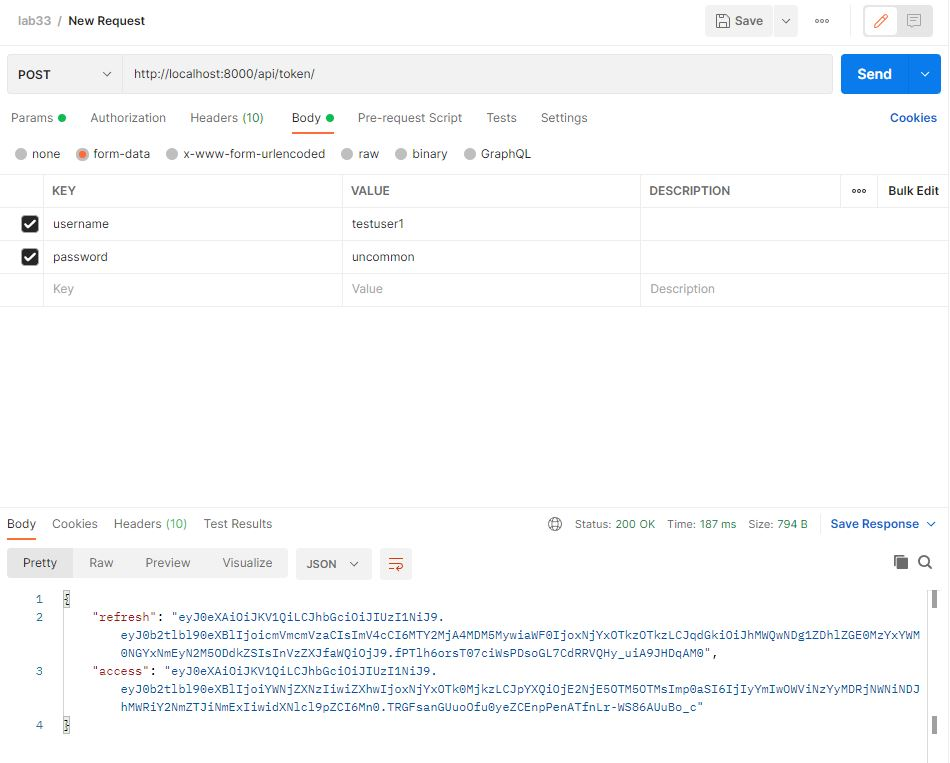

# Lab: 33
## Authentication & Production Server
## Author: Yu-Wei Hsieh
### Links and Resources
https://github.com/codefellows/seattle-code-python-401d19/tree/main/class-33/demo/authenticated-things

### Tests using Postman
I ust postman to test if I can get the tokens successfully. Here are the images.

Log in as admin:

Log in as testuser1
